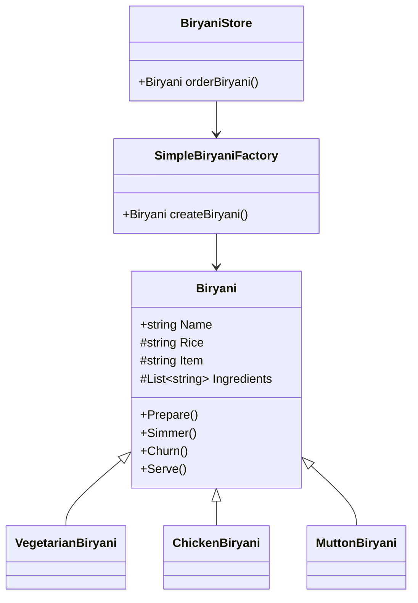
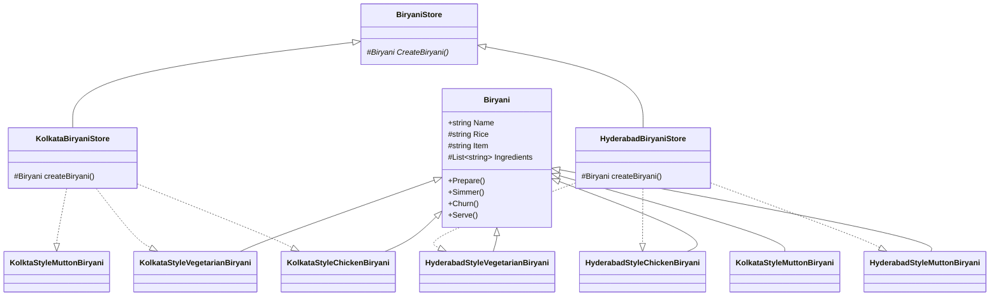
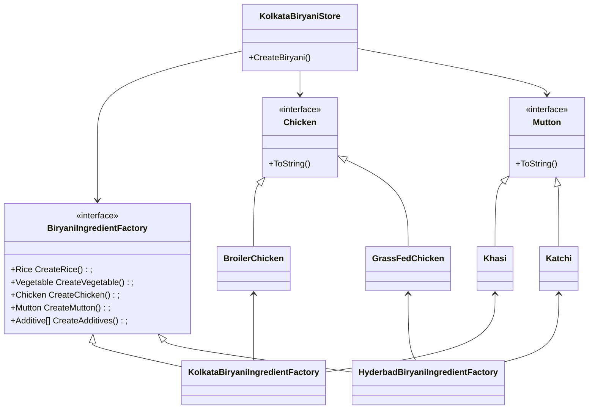

# Factory Pattern

This is the fourth chapter of "Head First Design Patterns" book.
Instead of using the example of a Pizza Store, I've tried to replicate the explanations for a Biryani Store.

To the uninitiated, Biryani is a very popular dish in South Asia. It is a rice based dish normally made with meat and a variety of exotic spices.

## The problem
Lets say that you have a Biryani (like BiryaniByKilo) shop which sells the following types of Biryani.
- Mutton
- Chicken
- Vegetable

Being a resounding success among the customers, demands arise from other cities to franchise your brand. We want to maintain the quality as well as offer to the palette of the region.

It is observed that the franchises are doing well with the procedures set. However, in order to increase their margins they are using inferior ingredients. We need to ensure consistency in the ingredients by controlling the supply chain.


## Thought process
- Major code changes will be necessary if we want to add or discontinue some types of Biryani.
- To avoid this, we want to move out the creation of Biryani to a different class. This is called a **Simple Factory**.


- While expansion to different regions, we need the flexibility to adapt to regional preferences as well as keeping up the standards. To do this, we implement the **Factory Method Pattern**.



- We ensure the regional variants of the ingredients should pass the necessary quality checks. So we decide to have our own ingredient production. This leads us to **Abstract Factory Pattern**.

Following is a simplified diagram of the abstract factory pattern


A more generic diagram will be


## Takeaways

- Simple Factory is not actually a Design Pattern. It's a programmatic idiam and indeed a very useful one.

The book defines, 

> The Factory Method Pattern defines an interface for creating an object, but lets subclasses decide which class to instantiate. It lets a class defer instantiation to subclasses.

> The Abstract Factory Pattern provides an interface for creating families of related or depenedent objects without specifying their concrete classes.

## Output

```
Preparing Kolkata Style Chicken Biryani 
 Marinating the Broiler Chicken...
 Adding ingredients....
 *Medium-Large Yellow Potato
 *Saffron from Pampore
 *Jaiphal / Jaadhikai of TN
 *Kewra from Ganjam of TN
 Adding Basmati rice from WB and water to the Broiler Chicken...
 Simmer the pot for few hours
 Churn the rice with the ingredients.
 Serve the dish
Srinjoy received the order for a Kolkata Style Chicken Biryani
Preparing Lucknow Style Vegetable Biryani 
 Marinating the Peas, carrots, cauliflower and French Beans...
 Adding ingredients....
 *Star Anise from Arunachal Pradesh
 *Saffron from Pampore
 *Cinnamon from Kerala
 Adding Basmati rice from WB and water to the Peas, carrots, cauliflower and French Beans...
 Simmer the pot for few hours
 Churn the rice with the ingredients.
 Serve the dish
Rohit received the order for a Lucknow Style Vegetable Biryani
Preparing Hyderabad Style Mutton Biryani 
 Marinating the Handi mutton...
 Adding ingredients....
 *Caramelised Fried Onion
 *Saffron from Pampore
 *Dried grapes from Sangli, Maharashtra and Cashew from Goa
 Adding Basmati rice from WB and water to the Handi mutton...
 Simmer the pot for few hours
 Churn the rice with the ingredients.
 Serve the dish
Ambar received the order for a Hyderabad Style Mutton Biryani
```